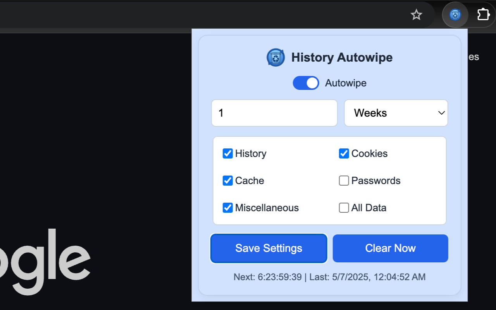

# History Autowipe

[](https://chromewebstore.google.com/detail/history-autowipe/gbljafgbpbbaciooamjdcpihokdgehee)

A lightweight Chrome extension that puts your privacy on autopilot. Instead of rummaging through menus every time you want to clear cookies or history, you set it once—choosing exactly which data types to purge and how often—and it quietly does the rest.

*Source: Chrome Web Store* ([extpose.com](https://extpose.com/ext/gbljafgbpbbaciooamjdcpihokdgehee?utm_source=chatgpt.com))

## Contents

```
manifest.json
popup.html
popup.js
background.js
style.css
privacy_policy.html
icon16.png
icon48.png
icon128.png
icon512.png
docs/
  └─ screenshot-popup-ui.png
```

## Features

- **Scheduled Wipes**: Automatically clear browsing history, cookies, cache, and other data at your chosen intervals.
- **Selective or All Data**: Toggle individual data types or use “All Data” for a complete purge.
- **Instant Cleanup**: Click **Clear Now** in the popup for on-demand wiping.
- **Live Status UI**: See when the next and last cleanups occurred.
- **Minimal Permissions**: Only requests “Clear browsing data” when you first activate each feature.
- **Lightweight & Private**: Leverages Chrome’s alarms API for low overhead; all operations run locally.

## Installation

### From Chrome Web Store

Install directly:
[Get History Autowipe on Chrome Web Store](https://chromewebstore.google.com/detail/history-autowipe/gbljafgbpbbaciooamjdcpihokdgehee)

### From Source

1. Clone the repository:
   ```bash
   git clone https://github.com/<your-username>/<repo-name>.git
   cd <repo-name>
   ```
2. Load as an unpacked extension:
   - Open `chrome://extensions/` in your browser.
   - Enable **Developer mode**.
   - Click **Load unpacked** and select this folder.

## Usage

1. Click the extension icon in the toolbar.
2. In the popup, select which data types to clear and set your cleaning schedule.
3. Use the **All Data** toggle for a full wipe or click **Clear Now** to perform an immediate cleanup.
4. Watch the live status display to see when the next and last wipes occur.

## Screenshots



## Contributing

1. Fork the repository.
2. Create a branch: `git checkout -b feature/YourFeature`.
3. Commit your changes: `git commit -m "Add feature"`.
4. Push to GitHub: `git push origin feature/YourFeature`.
5. Open a Pull Request for review.

## License

© 2025 Oussama Ennaciri. This project is licensed for personal and non-commercial use only. Commercial use, distribution, or monetization of this extension or its source code is prohibited without prior written permission from the author.
